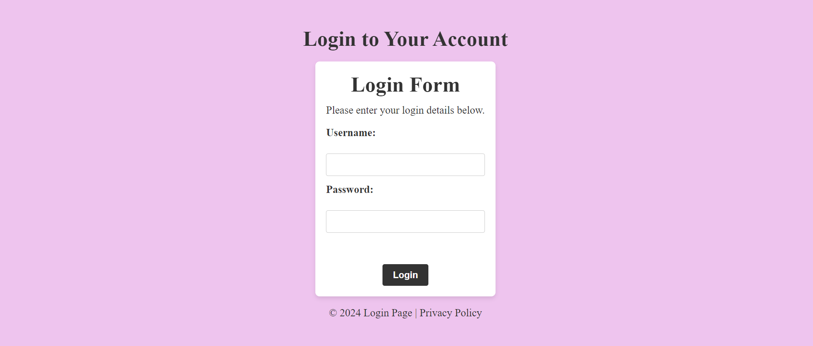

Hi All,

Below is the output page for the above code. This is an elegantly designed login form built with modern HTML5 and CSS3 techniques. The page emphasizes simplicity, ease of use, and cross-device compatibility.

Output Page:

How to Run:
To see this page in action, clone the repository and open the linkedin.html file in your browser. For more customization or to integrate this login page into your project, modify the linkedin.css file as needed.

Conclusion
Hope you find this example useful and welcome any feedback or suggestions.
